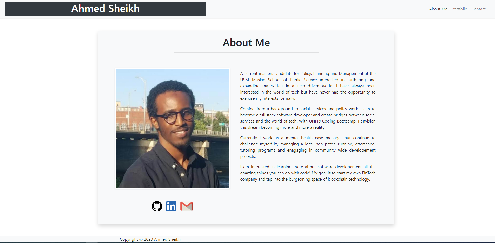

# 02-Responsive-Portfolio

# Description
This project includes a mobile responsive portfolio using the Bootstrap CSS Framework. It contains 3 pages: About, Portfolio & Contact.

# Requirements
Functional, deployed application GitHub repository with README describing the project Navbar must be consistent on each page. Navbar on each page must contain links to Home/About, Contact, and Portfolio pages. All links must work. Must use semantic html. Each page must have valid and correct HTML. (use a validation service) Must contain your personalized information. (bio, name, images, links to social media, etc.) Must properly utilize Bootstrap components and grid system.

# Deployment
The website can be reached here: [Responsive-Portfolio](https://asheikh-io.github.io/02-Responsive-Portfolio/)

# Images

1

# Authors
Ahmed Sheikh  [ASheikh-io](https://github.com/ASheikh-io)

# Acknowledgments
UNH Coding Bootcamp Instructors, TAs and Tutors
Bootstrap Developers